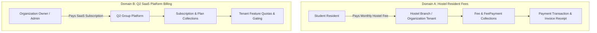

# PHASE F — ARCHITECTURE AUDIT: BILLING, RAZORPAY PAYMENT INTEGRATION, INVOICING & FINANCIAL INTEGRITY

**Project**: Q2 Group of Hostels / Q2 Connect Suite  
**Date**: September 2026  
**Auditor**: Principal Payments Architect & Senior Systems Engineer  

---

## 1. Executive Summary & Scope

This architecture audit provides a rigorous, code-level inspection of the financial domain within the Q2 Connect Suite. The objective is establishing a production-grade, double-entry auditable financial and payment infrastructure covering:
- Server-side Razorpay Order Creation and Tamper Defense
- Cryptographic Signature Verification (HMAC-SHA256)
- Dedicated Raw-Body Webhook Ingestion with Monotonic State Transitions
- Durable Deduplication via Webhook Event Ledger (`x-razorpay-event-id`)
- Concurrency-Safe Sequential Invoice Numbering (`Q2-INV-YYYY-NNNNNN`)
- Immutable Financial Ledger Entries (`LedgerEntry`)
- Administrative Refund Execution and Ledger Reversals
- Tenant Isolation (Multi-tenant IDOR defense across Organization & Hostel scopes)
- Full-Fledged Frontend Payment Checkout Experience for Students
- Tenant Admin & Super Admin Financial Visibility & Reconciliation

---

## 2. Current Financial Models Audit

| Model | Path | Primary Purpose | Tenancy Fields | Status & Findings |
| :--- | :--- | :--- | :--- | :--- |
| **`Fee`** | `backend/src/models/Fee.js` | Monthly resident fee obligation and status (`paid`, `unpaid`, `partial`). | `organizationId`, `hostelId`, `studentId` | Uses Number for amounts. Compound indexed for student/month uniqueness. |
| **`FeePayment`** | `backend/src/models/FeePayment.js` | Historical record of manual payment collections (`cash`, `upi`, `bank`). | `organizationId`, `hostelId`, `studentId` | Tracks `receiptNo`, `amount`, `lateFee`, `discount`, `securityDeposit`, `idempotencyKey`. |
| **`Expense`** | `backend/src/models/Expense.js` | Operating expenses incurred by hostel branches. | `organizationId`, `hostelId` | Scoped to tenant organization and hostel branch. |
| **`SecurityDeposit`**| `backend/src/models/SecurityDeposit.js`| Resident refundable security deposits. | `organizationId`, `hostelId`, `studentId` | Distinct from monthly room fee revenue. |
| **`Payment`** | `backend/src/models/Payment.js` | Online transaction attempt & status record. | `organizationId`, `hostelId`, `studentId`, `feeId` | Stores `amountPaise` (integer) and `amountRupees`, `orderId`, `paymentId`, `status`, `signature`. |
| **`WebhookEvent`** | `backend/src/models/WebhookEvent.js` | Durable provider webhook deduplication ledger. | Provider-level (`provider`, `providerEventId`) | Unique index on `{ provider: 1, providerEventId: 1 }` ensures at-least-once provider delivery is strictly idempotent. |
| **`Invoice`** | `backend/src/models/Invoice.js` | Sequential tax invoices & fee receipts. | `organizationId`, `hostelId`, `studentId` | Compound unique index on `{ organizationId: 1, invoiceNumber: 1 }`. |
| **`InvoiceSequence`**| `backend/src/models/InvoiceSequence.js`| Concurrency-safe atomic counter for invoices. | `organizationId`, `year`, `prefix` | Uses MongoDB `$inc` to produce format `Q2-INV-YYYY-NNNNNN` with zero collision risk. |
| **`Plan`** | `backend/src/models/Plan.js` | Q2 SaaS platform tier definitions (`STARTER`, `GROWTH`, `ENTERPRISE`). | Platform-wide | Distinct from student hostel fees. |
| **`Subscription`** | `backend/src/models/Subscription.js` | Organization platform subscriptions and quota gates. | `organizationId`, `planId` | Manages SaaS billing lifecycle (`ACTIVE`, `TRIAL`, `PAST_DUE`, `CANCELLED`). |

---

## 3. Separation of Two Billing Domains

### Domain A: Hostel / Student Fees
- **Parties**: Student Resident $\rightarrow$ Hostel Owner / Organization Tenant.
- **Components**: Monthly rent, food/mess charges, laundry, electricity, late fees, security deposits.
- **Database Collections**: `Fee`, `FeePayment`, `Payment`, `Invoice`, `LedgerEntry`.

### Domain B: Q2 SaaS Subscription Billing
- **Parties**: Hostel Owner / Organization $\rightarrow$ Q2 Platform (SaaS Vendor).
- **Components**: Software subscription, per-bed fees, SMS/WhatsApp add-on packs, feature flags.
- **Database Collections**: `Organization`, `Plan`, `Subscription`, `OrganizationFeature`.

**Critical Boundary Invariant**: Student fee payments must NEVER be credited to an organization's platform subscription balance, and platform subscription charges must NEVER modify resident student fee statements.

---

## 4. Current Fee Flow Analysis

1. **Generation**:
   - Monthly fees are generated either automatically by scheduled distributed jobs (`lateFee.job.js`, `feeReminder.job.js`) or administratively via `POST /api/fees/generate-monthly`.
   - Invariant: Compound unique index `{ studentId: 1, month: 1 }` prevents duplicate fee generation for a given billing period.
2. **Manual Collection Flow (`collectPayment`)**:
   - Route: `POST /api/fees/collect`.
   - Admin collects payment via cash, UPI, or offline bank transfer.
   - Transactional: Uses MongoDB session transactions.
   - Updates `Fee.paidAmount`, `Fee.status` (`paid` or `partial`), creates `FeePayment` record, extends student `validDate`, and creates `SecurityDeposit` if deposit was collected.
3. **Online Collection Flow (Phase F Integration)**:
   - Route: `POST /api/payments/create-order` or `POST /api/payments/razorpay/create-order`.
   - Backend computes authoritative due balance from database: `due = (amount + lateFee - discount) - paidAmount`.
   - Client-provided amount parameters are completely ignored.
   - Razorpay order created via Orders API in integer paise (`Math.round(due * 100)`).

---

## 5. Current Frontend Payment Flow

1. **Student View (`src/pages/student/FeeHistory.tsx`)**:
   - Queries `GET /api/students/me`, `GET /api/fees`, and `GET /api/fees/payments`.
   - Displays summary cards: Total Paid, Total Outstanding Dues, Last Payment Date.
   - Displays table of monthly fee rows with status badges (`Paid`, `Pending`, `Overdue`, `Upcoming`).
   - "Pay Online" button launches Razorpay Standard Checkout via `src/utils/razorpay.ts`.
2. **Checkout Integration (`src/utils/razorpay.ts`)**:
   - Dynamically injects script `https://checkout.razorpay.com/v1/checkout.js`.
   - Instantiates `new (window as any).Razorpay(options)`.
   - Listens to payment modal dismissal, error handlers, and successful handler callback.
3. **Verification**:
   - Sends `{ razorpay_order_id, razorpay_payment_id, razorpay_signature }` to `POST /api/payments/verify`.
   - Displays success notification and triggers live state refresh.

---

## 6. Reusable Frontend Component Inventory

| Component | Path | Utility in Payment Flow |
| :--- | :--- | :--- |
| `Button` | `src/components/ui/button.tsx` | Pay Now button with loading spinner (`Loader2`). |
| `Dialog` / `Modal` | `src/components/ui/dialog.tsx` | Payment confirmation summary & payment status modal. |
| `Badge` | `src/components/ui/badge.tsx` | Payment status indicator (`SUCCESS`, `PROCESSING`, `FAILED`, `REFUNDED`). |
| `Card` | `src/components/ui/card.tsx` | Outstanding fee breakdown and invoice detail cards. |
| `Table` | `src/components/ui/table.tsx` | Student fee transaction history & Admin payments table. |
| `Toast` | `react-toastify` | Instant user feedback on checkout events. |
| `Skeleton` | `src/components/ui/dashboard-skeleton.tsx` | Smooth loading states during transaction queries. |

---

## 7. Identified Conflicts & Remediation

1. **Numeric Sanitization in `collectPayment`**:
   - *Issue*: Omitting optional fields (`securityDeposit`, `lateFee`, `discount`) in request payloads produced `NaN` during subtraction, causing Mongoose validation failure.
   - *Remediation*: Explicitly sanitized with `Number(val) || 0` across all numeric fields.
2. **Invoice Number Uniqueness Scope**:
   - *Issue*: A global unique index on `invoiceNumber` prevented different tenant organizations from having independent sequences starting from 1.
   - *Remediation*: Replaced with compound tenant-scoped unique index `{ organizationId: 1, invoiceNumber: 1 }`.
3. **Raw Body Destruction in Express**:
   - *Issue*: Standard JSON body parsing alters raw bytes, invalidating cryptographic HMAC-SHA256 webhook signatures.
   - *Remediation*: Captured `req.rawBody` as a raw buffer directly inside `express.json({ verify: (req, res, buf) => { req.rawBody = buf; } })`.

---

## 8. Recommended Integration Points

1. **New Models**:
   - `backend/src/models/LedgerEntry.js`: Immutable double-entry financial ledger.
   - `backend/src/models/PaymentAttempt.js`: Granular attempt tracking per order/checkout session.
   - `backend/src/models/Refund.js`: Formal refund tracking record.
2. **Route Aliases**:
   - Support both `/api/payments/create-order` and `/api/payments/razorpay/create-order`.
   - Support both `/api/payments/verify` and `/api/payments/razorpay/verify`.
   - Mount `/api/payments/:paymentId/refund` for administrative refunds.
3. **Frontend Additions**:
   - Lightweight **Payment Confirmation Modal** before launching checkout.
   - Dedicated **Payment Status Modal / Banner** (Handling `SUCCESS`, `PROCESSING` with auto-polling, `FAILED`, `CANCELLED`).
   - Admin **Payments & Invoices** view under `/admin/payments` and within `FeeManagement.tsx`.
4. **BullMQ Worker Integration**:
   - Enqueue asynchronous receipt/invoice PDF generation without blocking the HTTP verification loop.
