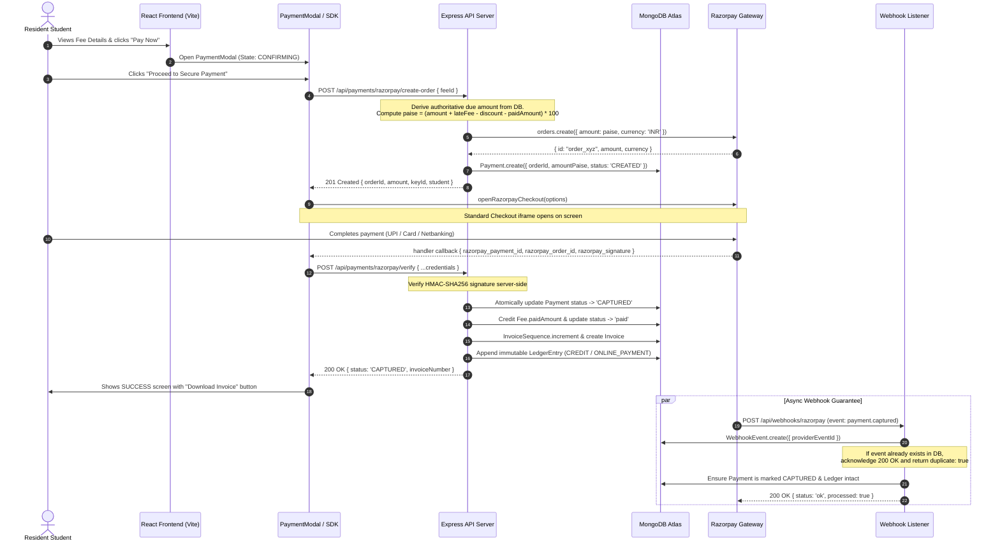
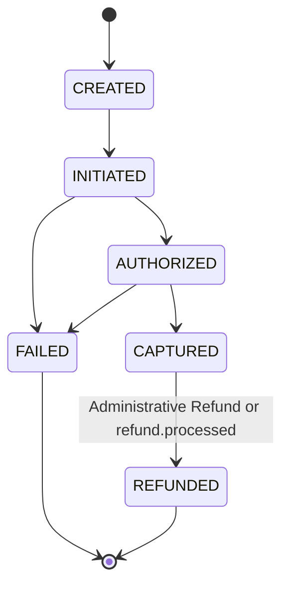
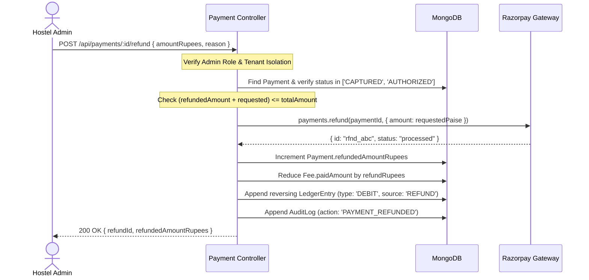

# PHASE F — END-TO-END PAYMENT & FINANCIAL FLOW SPECIFICATION

**Project**: Q2 Group of Hostels / Q2 Connect Suite  
**Scope**: Architecture, Sequences, State Machines & Concurrency  

---

## 1. End-to-End Payment Sequence Diagram



---

## 2. Frontend Payment Modal State Machine

```
              ┌───────────────┐
              │  CONFIRMING   │
              └───────┬───────┘
                      │ (Click "Proceed to Pay")
                      ▼
              ┌───────────────┐
              │CREATING_ORDER │
              └───────┬───────┘
                      │ (Order created)
                      ▼
              ┌───────────────┐
              │ CHECKOUT_OPEN │◀────────┐
              └───────┬───────┘         │
                      │                 │ (Retry)
         ┌────────────┼────────────┐    │
(Success)│            │(Cancelled) │(Error)
         ▼            ▼            ▼    │
   ┌───────────┐┌───────────┐┌──────────┼┐
   │ VERIFYING ││ CANCELLED ││  FAILED  ││
   └─────┬─────┘└───────────┘└──────────┼┘
         │                              │
         ├──────────────────────────────┤
  (OK)   ▼                              │ (Verification Failed)
   ┌───────────┐                        │
   │  SUCCESS  │                        │
   └───────────┘                        │
         ▲                              │
         └──────(Status Polling)────────┘
```

### State Definitions
1. **`CONFIRMING`**: Displays billing summary, fee month, outstanding balance, and breakdown before launching external SDK.
2. **`CREATING_ORDER`**: Disables buttons, requests server-side order generation, and guards against duplicate clicks.
3. **`CHECKOUT_OPEN`**: Razorpay Standard Checkout modal is visible.
4. **`VERIFYING`**: Client received credentials from Razorpay handler; communicates with `/api/payments/razorpay/verify`.
5. **`SUCCESS`**: Payment confirmed, receipt/invoice available for direct download.
6. **`PROCESSING`**: Displayed if verification timed out or network dropped; polls `/api/payments/:id` for up to 10 attempts.
7. **`CANCELLED`**: Resident closed modal before entering payment details; offers one-click retry.
8. **`FAILED`**: Gateway or bank rejected transaction; displays clear error message and enables retry.

---

## 3. Monotonic Payment State Machine

To prevent delayed or out-of-order webhook delivery from downgrading finalized transactions, state transitions enforce monotonic precedence:



### Transition Invariants
- **`CAPTURED` is terminal for forward progress**: Once a payment is `CAPTURED`, an incoming delayed `payment.failed` event will be acknowledged with 200 OK, but ignored internally without downgrading the payment status.
- **Refund Transitions**: Only `CAPTURED` or `AUTHORIZED` payments can transition to `REFUNDED`.

---

## 4. Concurrency & Race Condition Hardening

### Scenario A: Double-Click / Parallel Pay Requests
- **Frontend Guard**: `isProcessing` lock disables the button immediately upon the first click.
- **Backend Guard**: An atomic database transaction locks the fee. If the fee is already `paid`, order creation returns `400 Bad Request`.

### Scenario B: Parallel Payment Verification
- When concurrent calls hit `/api/payments/razorpay/verify` for the same `orderId`:
  - The first transaction atomically sets `status: 'CAPTURED'` and updates the fee.
  - Subsequent requests detect `status === 'CAPTURED'` and return `200 OK` with `{ message: 'Payment already verified (idempotent)' }`, avoiding duplicate fee crediting or ledger entries.

### Scenario C: Webhook Delivery Race
- If the Razorpay webhook arrives before the frontend verification returns:
  - The webhook verifies HMAC, sets `status: 'CAPTURED'`, updates the fee, and creates the ledger entry.
  - When the frontend verification subsequently runs, it recognizes the payment is already captured, returning the final status safely.
- If duplicate webhook deliveries arrive (e.g. Razorpay sends the same event 5 times):
  - The compound unique index on `{ provider: 1, providerEventId: 1 }` blocks duplicates.
  - Deliveries 2 through 5 return `200 OK` with `{ duplicate: true }` without executing side effects.

---

## 5. Administrative Refund Flow & Ledger Reversal


