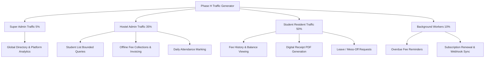

# Phase H: Platform Scale & Capacity Validation Plan
**Project:** Q2 Group of Hostels / Q2 Connect Suite  
**Document:** `PHASE_H_SCALE_TEST_PLAN.md`  
**Target Execution:** Phase H  
**Author:** Antigravity AI Senior Principal Systems Architect  

---

## 1. Executive Summary & Purpose

The purpose of Phase H is to empirically validate the scalability, throughput, resource consumption, and failure modes of the entire Q2 Connect Suite across realistic multi-tenant distributions.

The Phase G audit established that seeding 5 organizations and 250 students, while proving indexing and bounded query stability, is an architectural baseline and **does not constitute empirical validation** of 1,000+ organizations and 100,000+ students. 

This test plan defines the graduated scale tiers, realistic data distributions, traffic workloads, measurement protocols, and pass/fail thresholds for Phase H execution.

---

## 2. Graduated Scale Test Tiers

| Scale Dimension | Tier 1: Staging Baseline | Tier 2: Mid-Market Scale | Tier 3: Production Target |
| :--- | :---: | :---: | :---: |
| **Organizations** | 100 | 500 | **1,000+** |
| **Hostel Properties** | 200 | 1,000 | **2,500+** |
| **Active Students** | 10,000 | 50,000 | **100,000+** |
| **Rooms / Beds** | 4,000 | 20,000 | **45,000+** |
| **Monthly Fee Records** | 60,000 | 300,000 | **1,200,000+** |
| **Offline Fee Payments** | 50,000 | 250,000 | **1,000,000+** |
| **Attendance Records** | 200,000 | 1,000,000 | **3,000,000+** |
| **SaaS Subscriptions** | 100 | 500 | **1,000+** |
| **SaaS Invoices** | 600 | 3,000 | **12,000+** |
| **Financial Ledger Entries** | 100,000 | 500,000 | **2,000,000+** |

---

## 3. Realistic Data Modeling & Distributions

To avoid artificial test results from uniform dummy data, the Phase H generator must model realistic skewed distributions:

1. **Organization Size Skew (Power Law):**
   - 70% Small Organizations: 1–2 hostels, 50–150 students.
   - 25% Medium Organizations: 3–6 hostels, 200–800 students.
   - 5% Enterprise Hostel Chains: 10–25 hostels, 1,000–3,000 students.
2. **Fee Status & Collection Distribution:**
   - 65% Fully Paid (settled on-time via cash, bank transfer, or offline UPI).
   - 20% Partially Paid (with active remaining balances).
   - 15% Unpaid / Overdue (with late fees applied).
3. **Room Occupancy Rates:**
   - Realistic 82% average occupancy (mix of empty, partially occupied, and full rooms).
4. **Historical Aging:**
   - Operational records distributed across a rolling 12-month timeline to evaluate compound index time-range scans.

---

## 4. Multi-Domain Traffic Workload Profiles

Load generation will simulate realistic user behaviors across all platform personas:



### Workload Matrix:
1. **Super Admin (5% traffic):**
   - Analytics aggregations (`/api/super-admin/analytics/dashboard`).
   - Paginated organization lists with server-side filtering.
2. **Hostel Admin (35% traffic):**
   - Student roster pagination (`/api/students?page=1&limit=20`).
   - Manual fee recording (`/api/fees/payments`).
   - Room occupancy search (`/api/rooms?status=available`).
   - Daily attendance batch submission.
3. **Student Resident (50% traffic):**
   - Read-only fee ledger view (`/api/fees`).
   - Payment history & receipt download (`/api/fees/payments`).
   - Profile & dashboard rendering.
4. **Background Jobs & Billing (10% traffic):**
   - BullMQ batch processing of fee reminders.
   - Razorpay subscription webhook simulation (`subscription.charged`, `subscription.activated`).

---

## 5. Performance SLOs & Pass/Fail Criteria

| Endpoint / Operation | Target RPS | Target p50 | Target p95 | Target p99 | Max Error Rate |
| :--- | :---: | :---: | :---: | :---: | :---: |
| **Student Roster Listing (Admin)** | 250 RPS | < 50 ms | < 250 ms | < 500 ms | < 0.01% |
| **Student Fee Ledger View** | 300 RPS | < 40 ms | < 200 ms | < 400 ms | < 0.01% |
| **Offline Fee Collection (Write)** | 100 RPS | < 80 ms | < 300 ms | < 600 ms | 0.00% |
| **Sequential Invoice Generation** | 200 RPS | < 70 ms | < 250 ms | < 500 ms | 0.00% |
| **Super Admin Platform Overview** | 30 RPS | < 150 ms | < 600 ms | < 1,200 ms | < 0.05% |
| **Subscription Webhook Ingestion** | 150 RPS | < 50 ms | < 200 ms | < 400 ms | 0.00% |

### Resource Saturation Limits:
- **Node.js Process Memory:** `< 384 MB RSS` under sustained load (Zero progressive memory leaks).
- **MongoDB Connection Pool:** `< 85% utilization` (Mongoose pool size: 50).
- **CPU Utilization:** `< 75% average` across container instances.
- **Data Invariant Violations:** Strictly **0** (Zero duplicate invoice numbers, zero cross-tenant leaks).

---

## 6. Staging Prerequisites & Execution Runbook

### 6.1 Required Staging Infrastructure
- **MongoDB Atlas:** Dedicated M10 or M20 cluster (2 vCPU, 4GB RAM, 1,000 IOPS, Continuous Cloud Backup enabled).
- **Redis:** Upstash or Redis Cloud cluster with TLS enabled.
- **Backend Instances:** Render Standard container (1 CPU, 2GB RAM) or 2 scaled Starter instances.

### 6.2 Execution Sequence
1. **Pre-Flight Sanity:** Run `validate_data_integrity.js` and ensure 0 violations.
2. **Phase H Data Generator Execution:**
   ```bash
   node src/scripts/generate_phase_h_dataset.js --tier=1
   ```
3. **Load Benchmark Execution (Autocannon / K6):**
   ```bash
   node src/scripts/run_phase_h_benchmarks.js --duration=300s --concurrency=100
   ```
4. **Chaos Injection:**
   - Temporarily simulate Redis disconnect: verify graceful degradation to inline email and `DEGRADED` status reporting.
   - Simulate delayed webhook delivery: verify out-of-order monotonic safety.
5. **Post-Test Data Integrity Audit:**
   - Re-run `validate_data_integrity.js` to confirm zero orphan records or double-entry ledger discrepancies.
6. **Compile Final Report:**
   - Save empirical outputs to `PHASE_H_SCALE_TEST_REPORT.md`.

---
*Plan approved for Phase H execution upon cloud infrastructure provisioning.*
