# 🏢 Q2 Connect Suite — Next-Gen Multi-Tenant SaaS Hostel Management & Student Life Platform

<div align="center">


[](https://reactjs.org/)
[](https://www.typescriptlang.org/)
[](https://vitejs.dev/)
[](https://nodejs.org/)
[](https://www.mongodb.com/)
[](https://tailwindcss.com/)
[](https://socket.io/)
[](#)

**An enterprise-grade, multi-tenant SaaS ecosystem built for modern hostel operators, co-living spaces, student housing networks, and residential campuses.**

[Live Application Demo](https://q2-connect-suite.vercel.app/) • [Architecture](#-system-architecture) • [Core Portals](#-the-three-unified-portals) • [Getting Started](#-local-development-setup) • [API Reference](#-api-endpoints-reference)

---
</div>

## 📑 Table of Contents
- [Executive Overview](#-executive-overview)
- [Key Value Propositions](#-key-value-propositions)
- [System Architecture](#-system-architecture)
- [The Three Unified Portals](#-the-three-unified-portals)
  - [1. 👑 Super Administrator (SaaS Platform Owner)](#1--super-administrator-saas-platform-owner)
  - [2. 🏢 Hostel Administrator & Warden](#2--hostel-administrator--warden)
  - [3. 🎓 Resident & Student Life](#3--resident--student-life)
- [Multi-Tenant SaaS Data Model](#-multi-tenant-saas-data-model)
- [Complete Technology Stack](#-complete-technology-stack)
- [Repository Folder Structure](#-repository-folder-structure)
- [Security & Anti-Brute-Force Engine](#-security--anti-brute-force-engine)
- [Local Development Setup](#-local-development-setup)
- [Environment Variables Configuration](#-environment-variables-configuration)
- [Database Seeding & Pre-Configured Credentials](#-database-seeding--pre-configured-credentials)
- [API Endpoints Reference](#-api-endpoints-reference)
- [Deployment Guide](#-deployment-guide)
- [License & Authors](#-license--authors)

---

## 🌟 Executive Overview

**Q2 Connect Suite** modernizes student living and multi-hostel facility management into a streamlined digital experience. It bridges hostel owners, wardens, accountants, and residents into a unified, real-time operating system. 

Built from the ground up as a **Multi-Tenant SaaS**, a single instance can power hundreds of independent hostel chains and organizations, each with strict data isolation, custom subscription plans, branch management, and tenant-scoped user registries.

---

## 💡 Key Value Propositions

| Feature | For Hostel Owners & Super Admins | For Students & Residents |
| :--- | :--- | :--- |
| **Financial Automation** | Dynamic recurring monthly fees, partial collection, cashflow charts, automated P&L statements. | Transparent billing statements, downloadable PDF receipts, instant payment status. |
| **Admissions & Approval** | 2-step registration queue, roommate assignment, room capacity locking, Google Auth verification. | Quick Google OAuth registration, automated roommate discovery, digital onboarding. |
| **Living Operations** | Real-time mess meal off requests, automated rebate calculations, laundry machine queue manager. | Toggle mess off/on from mobile, book laundry slots in real-time, view live weekly menu. |
| **Facility Care** | Categorized ticketing system with status workflows (`pending`, `in-progress`, `resolved`). | Instant complaint filing with photo attachments, progress tracking, suggestion box. |
| **SaaS Multi-Tenancy** | Organization-level tenant isolation, plan feature gating, audit-logged support impersonation. | Clean, branded student portal with 100% mobile-responsive design. |

---

## 🏗️ System Architecture

```mermaid
graph TD
    subgraph Clients ["Client Layer (Web & Mobile PWA)"]
        SuperAdminUI["👑 Super Admin Console"]
        HostelAdminUI["🏢 Hostel Admin & Warden Dashboard"]
        StudentUI["🎓 Resident Student Portal"]
    end

    subgraph Gateway ["API Gateway & Security Layer"]
        RateLimit["Rate Limiting & Helmet"]
        CORS["CORS & Origin Security"]
        AuthMiddleware["JWT Verification & Anti-Brute Force"]
        TenantMiddleware["Multi-Tenant Scoping Middleware"]
        RBAC["Role-Based Access Control (RBAC)"]
    end

    subgraph Backend ["Express.js Micro-Modular Core"]
        AuthCtrl["Auth & Google OAuth Controller"]
        TenantCtrl["SaaS Organization & Billing Controller"]
        StudentCtrl["Student Admissions & Profile Controller"]
        FeeCtrl["Fee Invoicing & Cashflow Controller"]
        RoomCtrl["Room & Bed Matrix Controller"]
        MessCtrl["Mess Requests & Menu Controller"]
        LaundryCtrl["Laundry Scheduler Controller"]
        SocketServer["Socket.io Real-Time Broker"]
    end

    subgraph DataServices ["Persistent Storage & Third-Party APIs"]
        MongoDB[("🍃 MongoDB Atlas Database")]
        ImageKit["🖼️ ImageKit CDN (Document & Photo Storage)"]
        GmailSMTP["📧 Nodemailer Gmail SMTP Service"]
        GoogleAPI["🔑 Google OAuth2 Identity Provider"]
    end

    Clients --> Gateway
    Gateway --> Backend
    Backend --> DataServices
```



---

## 🌐 The Three Unified Portals

### 1. 👑 Super Administrator (SaaS Platform Owner)
*Route: `/super-admin/dashboard`*

- **Platform Intelligence:** System-wide Monthly Recurring Revenue (MRR), total tenant organizations, active bed count, and aggregate resident capacity.
- **Tenant Management:** Provision, suspend, and configure new hostel companies and educational housing trusts.
- **Subscription Engine:** Configure plan tiers (`Starter`, `Growth`, `Enterprise`) and toggle modular feature gates (e.g., Cashflow Analyzer, SMS Gateway, Biometrics).
- **Impersonation Support:** Securely log into any tenant's hostel dashboard for customer support without sharing passwords, with full session audit logging (`ImpersonationSession`).

### 2. 🏢 Hostel Administrator & Warden
*Route: `/admin/dashboard`*

- **Admissions & 2-Step Resident Setup:** Review students who signed up via Google OAuth, verify contact records, assign specific rooms/beds, set monthly rental fees, and approve accounts with automated email notifications.
- **Room & Bed Matrix:** Interactive visual map of all hostel branches (e.g., `Q2 Main`, `Q2.0 Extension`, `Q2.1 Executive`), tracking occupied, reserved, and available beds.
- **Automated Financial Engine & Invoicing:**
  - Automated monthly fee billing generation.
  - Partial fee payment processing with balance tracking.
  - Security deposit ledger (refundable deposits, deductions).
  - Dynamic **Cashflow Analyzer** & **Profit & Loss (P&L)** breakdown.
  - Client-side PDF receipt generation powered by `jspdf` and `jspdf-autotable`.
  - Export full resident and financial records to Microsoft Excel (`.xlsx`).
- **Mess & Dietary Operations:** Real-time log of meal off requests, attendance tracking, and weekly digital menu planner.
- **Laundry Queue System:** Manage machine availability, operational time slots, and token bookings.
- **Support & Complaints Center:** Triage maintenance, plumbing, electrical, and internet tickets with priority tags and real-time updates.

### 3. 🎓 Resident & Student Life
*Route: `/student/dashboard`*

- **One-Tap Identity:** Hybrid authentication via Google One-Tap OAuth or student ID credentials.
- **My Living Space:** Room allocation card, assigned bed number, hostel branch details, and current roommates.
- **Billing & Receipts:** Personal fee ledger, pending dues indicator, payment history, and instant PDF receipt download.
- **Smart Mess Management:** Request "Mess Off" in advance with date ranges for meal rebates; check the breakfast, lunch, snacks, and dinner menu.
- **Laundry Scheduler:** Reserve laundry machine time slots to prevent hostel queue bottlenecks.
- **Complaints & Feedback:** Submit maintenance tickets with photos, monitor progress, and suggest hostel improvements.

---

## 🗄️ Multi-Tenant SaaS Data Model

```
                    ┌────────────────────────┐
                    │      Organization      │
                    │  (Tenant / Hostel Org) │
                    └───────────┬────────────┘
                                │ 1:N
             ┌──────────────────┼──────────────────┐
             │                  │                  │
             ▼                  ▼                  ▼
     ┌──────────────┐   ┌──────────────┐   ┌──────────────┐
     │ Subscription │   │  Membership  │   │    Hostel    │
     │   (Plan)     │   │ (Staff/Admin)│   │  (Branches)  │
     └──────────────┘   └──────────────┘   └──────┬───────┘
                                                  │ 1:N
                                   ┌──────────────┴──────────────┐
                                   ▼                             ▼
                            ┌──────────────┐              ┌──────────────┐
                            │     Room     │              │   Student    │
                            │  (Bed Matrix)│              │  (Resident)  │
                            └──────┬───────┘              └──────┬───────┘
                                   │                             │
                                   └──────────────┬──────────────┘
                                                  │
                                   ┌──────────────┴──────────────┐
                                   ▼                             ▼
                            ┌──────────────┐              ┌──────────────┐
                            │  Fee / Bill  │              │  Complaint / │
                            │  & Payments  │              │ Laundry/Mess │
                            └──────────────┘              └──────────────┘
```

---

## 💻 Complete Technology Stack

### Frontend Application
- **Core Framework:** React 18.3 + TypeScript 5.8
- **Build & Dev Tool:** Vite 8.1 + `@vitejs/plugin-react-swc`
- **Styling & Design System:** TailwindCSS 3.4, `@tailwindcss/typography`, `tailwindcss-animate`
- **UI Components:** Radix UI Primitives, `shadcn-ui`, Lucide Icons
- **Animation & 3D:** Framer Motion 11, Three.js, `@react-three/fiber`, `@react-three/drei`
- **Data Fetching & State:** TanStack React Query 5, Axios (with automatic token refresh interceptors)
- **Visual Analytics:** Recharts 2.15 (Area, Bar, Pie, and Radial charts)
- **Document & Data Generation:** `jspdf`, `jspdf-autotable`, `xlsx`
- **Real-Time Client:** `socket.io-client` 4.8

### Backend Infrastructure
- **Runtime:** Node.js (v18+) with Express 4.21
- **Database & ODM:** MongoDB Atlas with Mongoose 8.24
- **Security & Hygiene:** `helmet`, `cors`, `express-rate-limit`, `express-mongo-sanitize`, `xss-clean`
- **Authentication:** `jsonwebtoken` (Access + Refresh Token rotation), `bcryptjs` (salt 12)
- **OAuth Provider:** `google-auth-library`
- **Cloud Media Storage:** `@imagekit/nodejs`
- **Email Notifications:** `nodemailer` with Gmail App Passwords
- **Real-Time Broker:** `socket.io` 4.7
- **Job Scheduling:** `node-cron` (automated monthly billing generation)

---

## 📂 Repository Folder Structure

```
q2-connect-suite/
├── backend/                         # Node.js & Express REST API Server
│   ├── src/
│   │   ├── config/                  # DB connection & external service configs
│   │   │   ├── db.js                # MongoDB Atlas connection with SRV DNS resolver
│   │   │   └── imagekit.js          # ImageKit SDK client
│   │   ├── controllers/             # HTTP route controller handlers (17 controllers)
│   │   │   ├── auth.controller.js   # Login, admin login, Google OAuth, password reset
│   │   │   ├── superAdmin.controller.js # Multi-tenant orgs, metrics, impersonation
│   │   │   ├── students.controller.js   # Resident admissions, updates, approvals
│   │   │   ├── fees.controller.js       # Billing generation, fee collection
│   │   │   ├── rooms.controller.js      # Bed allocation & room inventory
│   │   │   ├── messRequests.controller.js
│   │   │   └── laundry.controller.js
│   │   ├── middleware/              # Interceptors & protection guards
│   │   │   ├── auth.middleware.js   # JWT token validation
│   │   │   ├── rbac.middleware.js   # SuperAdmin, Admin, Student permission gates
│   │   │   ├── tenant.middleware.js # Multi-tenant organization scoping
│   │   │   └── feature.middleware.js# Subscription feature flag checks
│   │   ├── models/                  # Mongoose Schemas (24 models)
│   │   │   ├── User.js              # Multi-role authentication document
│   │   │   ├── Organization.js      # Tenant entity
│   │   │   ├── Student.js           # Resident profiles & hostel records
│   │   │   ├── Fee.js & FeePayment.js
│   │   │   └── Room.js
│   │   ├── routes/                  # Express route declarations
│   │   ├── scripts/                 # CLI & database utilities
│   │   │   ├── seedSuperAdmin.js    # Dedicated superadmin seeding & unlocking
│   │   │   ├── seedSaaSEnvironment.js # Full multi-tenant SaaS environment seed
│   │   │   └── resetDatabase.js     # Pristine clean database reset
│   │   ├── services/                # Business logic & domain abstractions
│   │   └── app.js                   # Express application entry & socket initialization
│   ├── package.json
│   └── .env                         # Backend environment variables
│
├── src/                             # React + TypeScript Frontend
│   ├── components/                  # Reusable UI & domain components (117 components)
│   │   ├── auth/                    # ProtectedRoute guards (SuperAdmin, Admin, Student)
│   │   ├── landing/                 # 3D visuals, hero, pricing, feature sections
│   │   ├── super-admin/             # Multi-tenant widgets, impersonation banner
│   │   └── ui/                      # Radix / shadcn-ui component primitives
│   ├── hooks/                       # Custom React hooks (useAuth, useHostel, etc.)
│   ├── pages/                       # Screen routes & views (45 views)
│   │   ├── admin/                   # Cashflow, FeeManagement, Rooms, Admissions
│   │   ├── student/                 # Student Dashboard, MessOff, Complaints, Laundry
│   │   ├── super-admin/             # Tenant Organizations, Plans, SaaS Analytics
│   │   └── Login.tsx                # Role-aware authentication page
│   ├── services/api/                # Axios API modules
│   ├── types/                       # TypeScript interfaces & domain declarations
│   ├── App.tsx                      # React router configuration & lazy loading
│   └── main.tsx                     # React DOM bootstrap
│
├── package.json                     # Frontend dependencies & workspace scripts
├── tailwind.config.ts               # Custom styling tokens & theme extensions
├── vite.config.ts                   # Vite bundler configuration
└── README.md                        # Project documentation
```

---

## 🔒 Security & Anti-Brute-Force Engine

Q2 Connect Suite implements enterprise-grade security protocols:

1. **Anti-Brute Force Lockout:**
   - Tracks `failedLoginAttempts` per user account.
   - Upon **5 consecutive failed attempts**, the account enters a **15-minute lockout** (`lockUntil`).
   - The user receives remaining attempts warnings (`4 attempts remaining`, etc.) and lockout countdowns in real-time.
2. **Password Cryptography:**
   - Salt-12 `bcryptjs` hashing applied on pre-save hooks.
   - Passwords and refresh tokens are stripped from all JSON responses via `toJSON()` transform overrides.
3. **Dual Token Architecture:**
   - **Access Token:** Short-lived (15 minutes) signed with `JWT_SECRET`.
   - **Refresh Token:** Long-lived (7 days) signed with `JWT_REFRESH_SECRET`, stored in database with rotation to prevent session hijacking.
4. **Tenant Isolation Guarantees:**
   - Every database query for hostel data is filtered by `organizationId` and `activeHostelId`.
   - Cross-tenant data leakage is strictly prevented at the middleware level.

---

## 🚀 Local Development Setup

### Prerequisites
- **Node.js**: v18.0.0 or higher
- **npm**: v9.0.0 or higher
- **MongoDB**: Active MongoDB Atlas cluster or local MongoDB instance

### Step 1: Clone the Repository
```bash
git clone https://github.com/mr-vishwakarma/q2-connect-suite.git
cd q2-connect-suite
```

### Step 2: Install Dependencies
Install both frontend and backend dependencies:
```bash
# Install frontend packages
npm install

# Install backend packages
npm --prefix backend install
```

### Step 3: Configure Environment Variables
Create your local environment files based on the templates below:
- Create `backend/.env`
- Create `.env` (in root for frontend)

### Step 4: Seed the Database
Populate your MongoDB database with essential SaaS plans, organizations, and the Super Admin account:
```bash
# Seed the Super Administrator credentials
npm --prefix backend run seed:superadmin

# (Optional) Seed complete multi-tenant SaaS mock environment
npm --prefix backend run seed:saas
```

### Step 5: Launch the Development Servers
In two separate terminal windows:

```bash
# Terminal 1: Start the Backend Server (Port 5000)
cd backend
npm run dev

# Terminal 2: Start the Frontend Application (Port 8080)
npm run dev
```

Visit **`http://localhost:8080`** in your browser.

---

## ⚙️ Environment Variables Configuration

### Backend Environment (`backend/.env`)
```env
# Server Configuration
PORT=5000
NODE_ENV=development

# MongoDB Connection String (Atlas SRV or Local)
MONGODB_URI=mongodb+srv://<username>:<password>@cluster.mongodb.net/q2connect?retryWrites=true&w=majority

# JWT Authentication Secrets
JWT_SECRET=your_super_secret_jwt_access_key_change_in_production
JWT_REFRESH_SECRET=your_super_secret_jwt_refresh_key_change_in_production
JWT_EXPIRES_IN=15m
JWT_REFRESH_EXPIRES_IN=7d

# ImageKit CDN (Document & Resident Photo Uploads)
IMAGEKIT_PUBLIC_KEY=your_imagekit_public_key
IMAGEKIT_PRIVATE_KEY=your_imagekit_private_key
IMAGEKIT_URL_ENDPOINT=https://ik.imagekit.io/your_id

# Nodemailer Email Notifications (Gmail SMTP)
SMTP_HOST=smtp.gmail.com
SMTP_PORT=587
SMTP_USER=your_email@gmail.com
SMTP_PASS=your_gmail_app_password
EMAIL_FROM=Q2 Connect Suite <your_email@gmail.com>

# Frontend URL (for CORS validation)
FRONTEND_URL=http://localhost:8080

# Google OAuth 2.0 Client ID (Optional in dev, required in production)
GOOGLE_CLIENT_ID=your_google_client_id.apps.googleusercontent.com
```

### Frontend Environment (`.env`)
```env
# Backend REST API Base URL
VITE_API_BASE_URL=http://localhost:5000/api

# WebSocket Server URL
VITE_SOCKET_URL=http://localhost:5000

# Google OAuth 2.0 Client ID for One-Tap Sign In
VITE_GOOGLE_CLIENT_ID=your_google_client_id.apps.googleusercontent.com
```

---

## 🔑 Database Seeding & Pre-Configured Credentials

| Role | Username / Identifier | Email | Password | Access Rights |
| :--- | :--- | :--- | :--- | :--- |
| **👑 Super Admin** | `superadmin` | `superadmin@q2connect.com` | `SuperAdmin@123` | Full SaaS Platform Owner, All Tenants & Settings |
| **🏢 Primary Admin** | `Abhi1006` | `abhi1006@q2connect.com` | `Admin@123` | Hostel Operations Manager (Q2, Q2.0, Q2.1) |
| **🎓 Sample Resident**| `student` | `student@q2connect.com` | `Student@123` | Resident Portal (Room 101, Bed A) |

To re-seed or unlock the superadmin account at any time:
```bash
npm --prefix backend run seed:superadmin
```

---

## 📡 API Endpoints Reference

### Authentication (`/api/auth`)
- `POST /api/auth/login` — Resident & general user authentication.
- `POST /api/auth/admin/login` — Administrator & Super Admin role-verified login.
- `POST /api/auth/google` — Google OAuth 2.0 credential exchange & automatic profile sync.
- `POST /api/auth/register-request` — Step 1 resident Google registration submission.
- `POST /api/auth/refresh-token` — Rotate access token using valid refresh token.
- `POST /api/auth/forgot-password` — Send password reset token via email.
- `POST /api/auth/reset-password` — Update password with verified reset token.

### Super Administrator (`/api/super-admin`)
- `GET /api/super-admin/analytics/dashboard` — Platform-wide metrics, MRR, occupancy.
- `GET /api/super-admin/organizations` — List all registered tenant organizations.
- `POST /api/super-admin/organizations` — Provision new hostel organization.
- `POST /api/super-admin/impersonate` — Start secure tenant impersonation session.
- `DELETE /api/super-admin/impersonate` — Terminate impersonation session.

### Student & Admissions Management (`/api/students`)
- `GET /api/students` — List residents (filterable by hostel branch, room, fee status).
- `POST /api/students` — Direct student registration by administrator.
- `GET /api/students/pending` — Fetch residents awaiting Step 2 admin approval.
- `POST /api/students/:id/approve` — Approve student, assign room, allocate fees.
- `POST /api/students/:id/reject` — Reject resident admission with reason.

### Financial Operations (`/api/fees`)
- `GET /api/fees/dashboard` — Financial overview, total dues, monthly collections.
- `GET /api/fees/cashflow` — Dynamic inflow/outflow records and profit/loss calculation.
- `POST /api/fees/generate-monthly` — Trigger automated recurring monthly invoices.
- `POST /api/fees/collect` — Record partial or full fee payment with receipt generation.

### Room & Inventory Operations (`/api/rooms`)
- `GET /api/rooms` — Complete list of rooms, bed capacities, and current occupancy.
- `POST /api/rooms` — Create room with branch and capacity parameters.
- `PUT /api/rooms/:id/assign-bed` — Allocate bed to a student.

### Mess & Dining (`/api/mess`)
- `GET /api/mess/requests` — List active meal off requests.
- `POST /api/mess/requests` — Submit resident meal off period.
- `GET /api/mess/menu` — Fetch current weekly hostel menu.

### Maintenance & Complaints (`/api/complaints`)
- `GET /api/complaints` — Retrieve complaints list by hostel branch.
- `POST /api/complaints` — Create new complaint ticket with attachments.
- `PATCH /api/complaints/:id/status` — Update resolution state (`pending`, `in_progress`, `resolved`).

---

## 🚢 Deployment Guide

### Frontend Deployment (Vercel)
1. Push your repository to GitHub.
2. Link the repository to [Vercel](https://vercel.com/).
3. Set Framework Preset to **Vite**.
4. Configure Build Command: `npm run build` and Output Directory: `dist`.
5. Add Environment Variables:
   - `VITE_API_BASE_URL` (Points to your live backend domain, e.g. `https://api.yourdomain.com/api`)
   - `VITE_GOOGLE_CLIENT_ID`

### Backend Deployment (Render / Railway / Cloud VPS)
1. In Render/Railway, create a new **Web Service** from the GitHub repository.
2. Set Root Directory to `backend`.
3. Set Build Command: `npm install`.
4. Set Start Command: `npm start`.
5. Supply all backend environment variables (`MONGODB_URI`, `JWT_SECRET`, `SMTP_*`, `FRONTEND_URL`, etc.).

---

## 📄 License & Authors

This project is developed and maintained for **Q2 Connect Suite**. All rights reserved.

Created with modern web engineering standards for high-performance residential property management.
